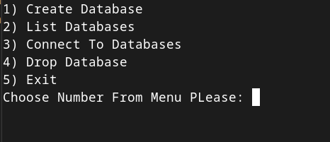
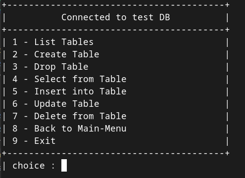
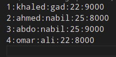
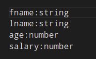

# Bash Shell Script Database Management System (DBMS)
The Project aim to develop DBMS, that will enable users to store and retrieve the data from Hard disk.

 

---

## Overview

The project is a CLI Menu based app, that will provide to user this 2 Menus to make operations in database or tables

 

---

## How to run the project
- after cloning or downloading the project just run the main manu script `./main-manu.sh`

 

---

## Main Menu
- Create Database
- List Databases
- Drop Database
- Connect To Databases

 

  

 

---

## Tables operations menu
Upon user Connect to Specific Database, there will be new Screen with this Menu:
- List Tables
- Create Table 
- Drop Table
- Select From Table
- Insert into Table
- Update Table
- Delete From Table
- Back to Main Menu
- Exit

  

  

 

---

## Project Structure

The project contain 2 main directories
- **Databases** : store all database as a directory
    - Each Database (directory) store tables as a files
    - The table have 2 files
        - file for _data_ which is colon sperated file
        

            
              <i>table data</i>
        

        - file for _meta-data_ about the table 
        

            
              <i>table meta-data</i>
        

- **scripts** : contain all scripts that used in the project divided to 2 directories
    - _**db**_ : contain all scripts related to database 
        - Create 
        - Drop 
        - List 
        - Connect
    - _**tables**_ : contain all scripts related to tables
        - Create
        - List
        - Drop
        - Select
        - Insert
        - Update
        - Delete
    - _**custom-menu**_ script
        - script that accept a title and an array then display the array elements in well formatted table

 

---

### Team Members:

- **Khaled Gad**
    - [Github](https://github.com/KhalidGad)
    - [LinkedIn](https://www.linkedin.com/in/khalildgad/)
- **Ahmed Nabil**
    - [Github](https://github.com/AhmedNabilSharawy)
    - [LinkedIn](https://www.linkedin.com/in/ahmed-nabil-sharawy-149880104/)
 

_**ITI**_

_**intake 43**_

_**Cloud Platform Development**_
